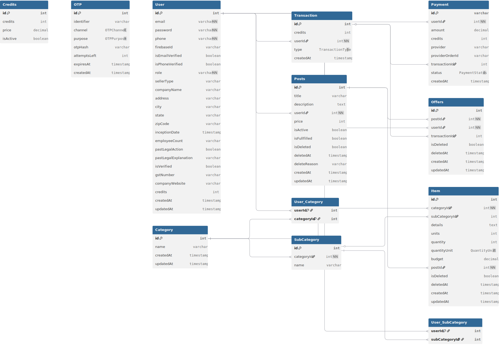

<h1>BNB Services</h1>

<p>A platform for buyers and sellers to connect and exchange services.</p>

<h3>Tech Stack</h3>
<hr style="height:1px; margin: 10px 0" />
<div>
    
    
    
    
    
    
    <ul>
        <li style="font-weight: bold;">
            Frontend + Backend: <span style="font-weight: normal;">Next.JS</span>
        </li>
        <li style="font-weight: bold;">
            Styling: <span style="font-weight: normal;">Tailwind CSS</span>
        </li>
        <li style="font-weight: bold;">
            Database: <span style="font-weight: normal;">PostgreSQL</span>
        </li>
        <li style="font-weight: bold;">
            ORM: <span style="font-weight: normal;">Prisma</span>
        </li>
    </ul>
</div>
<h3>Quick Start</h3>
<hr style="height:1px; margin: 10px 0" />
<div>
    <h4>Prerequisites</h4>
    <ul>
        <li style="font-weight: bold;">
            <span style="font-weight: normal;">Node.js, npm</span>
        </li>
        <li style="font-weight: bold;">
            <span style="font-weight: normal;">PostgreSQL Database</span>
        </li>
        <li style="font-weight: bold;">
            <span style="font-weight: normal;">Firebase Project with Billing Setuped</span>
        </li>
    </ul>
</div>

<h4>Installation</h4>

1. Clone the repository
    ```bash
        git clone https://github.com/mukulubnext/bnbServices
    ```

2. Install all the dependencies
    ```bash
        npm install
    ```

3. Setup `.env` file similar to `.env.example` with your own values

4. Start the development server with
    ```bash
        npm run dev
    ```

<h4>Project Structure</h4>

    src/
        app/                        # Pages and API Routes
            api/                    # API Routes
                vx/                 # Version number x
                  auth/             # Authentication Routes
                  category/         # Category Routes
                  post/             # Post Routes
                  offer/            # Offer Routes
                  transactions/     # Transaction Routes
                  user/             # User Routes
                  credits/          # Credits Routes
                  otp/              # OTP Routes
            .
            .
            (route)/                # Pages
                components/         # Page Components
                page.tsx
            .
            .
        components/                 # Global Components
        context/
            AuthContext.tsx         # Auth Context - returns {user, loading, refresh}
        hooks/
            useDebounce.tsx         # Debounce Hook
            usePersistedState.tsx   # Persistent State Hook for saving form data in localStorage
        lib/                        # Utility Functions
        mail/                       # Email Templates in EJS

<hr>
<h3>Database Model</h3>
<hr>


<h6>All individual pages are further documented in there respective files with inline comments.</h6>
<h6>For any development/code related issues contact - <a href="https://github.com/CodewithMukal">Here</a></h6>